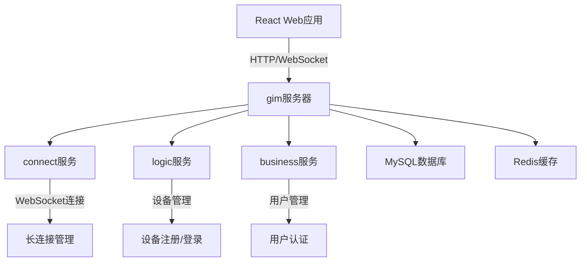
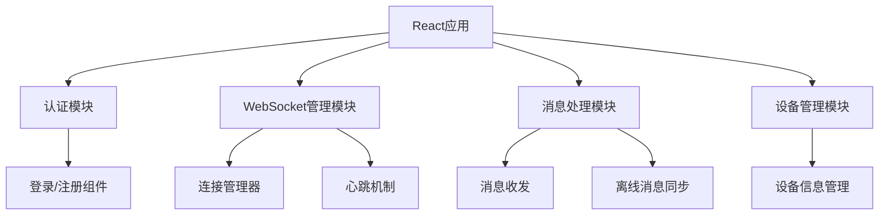
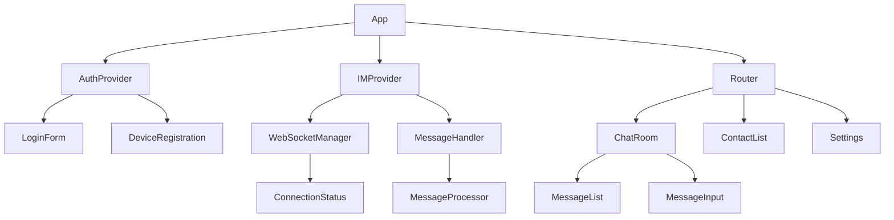
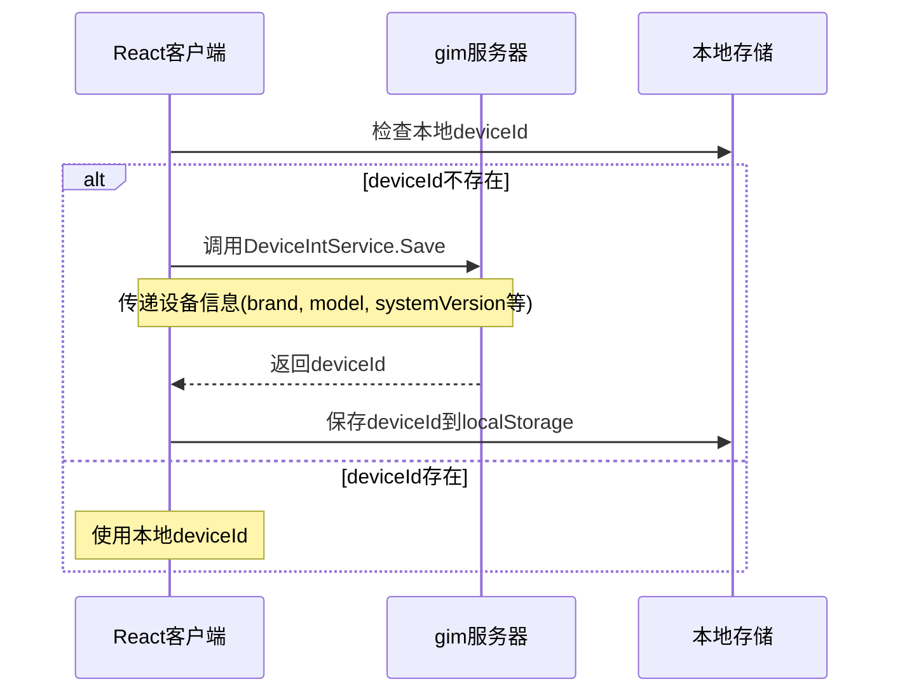
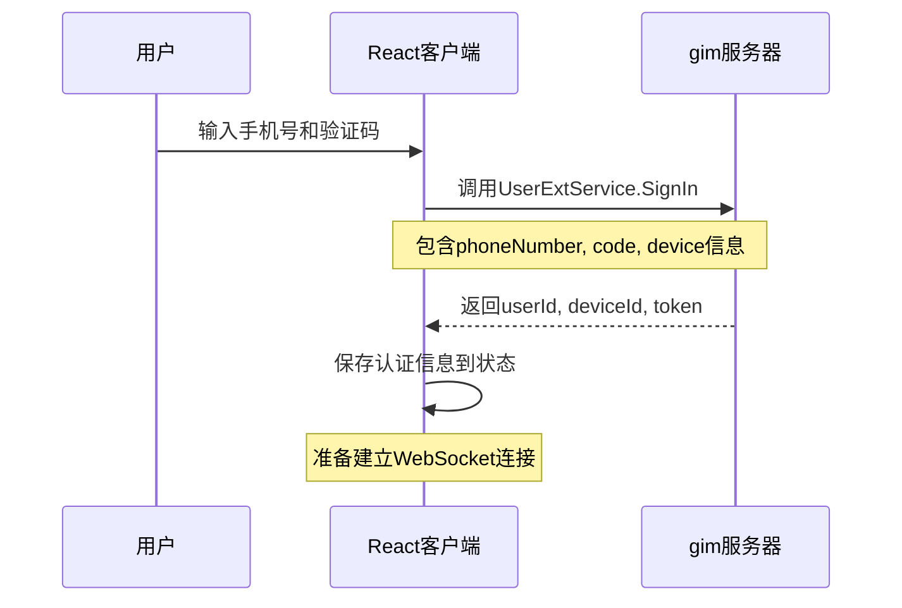
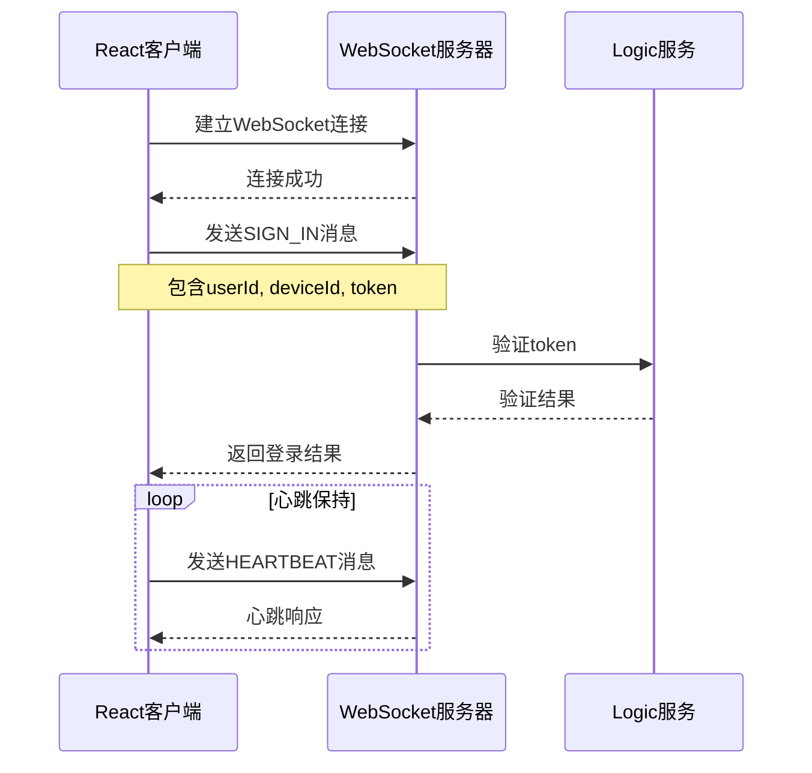
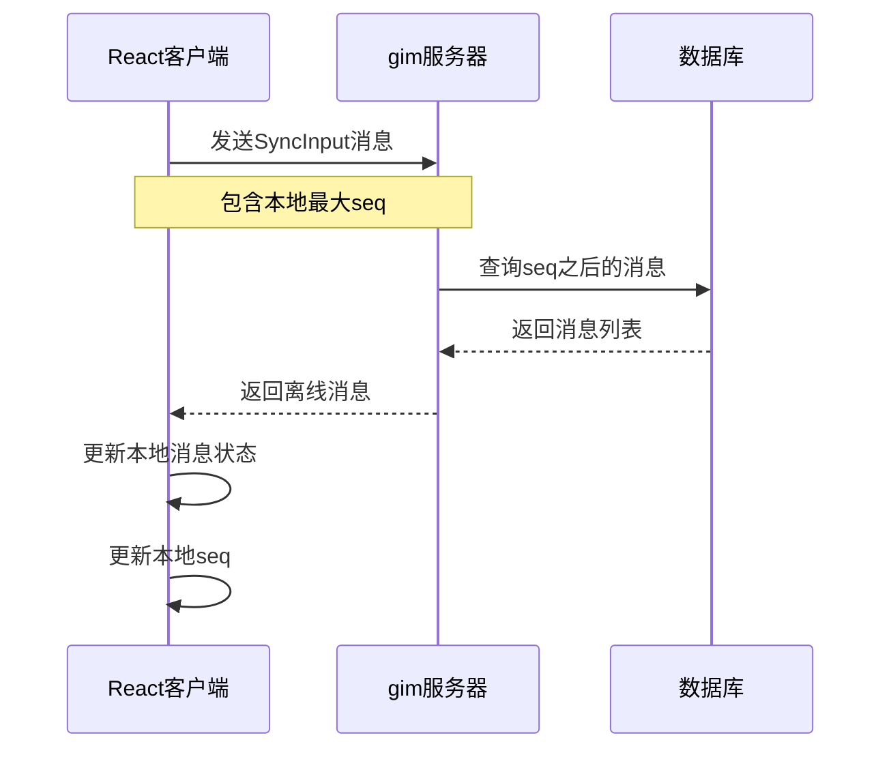

# React集成gim即时通讯系统设计

## 概述

本设计文档描述如何使用React框架集成gim即时通讯系统，实现设备注册、用户登录和WebSocket长连接功能。gim是一个基于Go语言开发的即时通讯服务器，支持TCP和WebSocket接入，提供用户登录、设备管理、消息推送等功能。

## 技术架构

### 系统组件架构



### 前端架构设计



## React组件架构

### 组件层次结构



### 核心组件定义

#### 1. 认证模块 (AuthProvider)

```typescript
interface AuthContextType {
  user: User | null;
  deviceId: string | null;
  token: string | null;
  isAuthenticated: boolean;
  login: (phoneNumber: string, code: string) => Promise<LoginResult>;
  logout: () => void;
  registerDevice: () => Promise<string>;
}
```

#### 2. WebSocket管理模块 (IMProvider)

```typescript
interface IMContextType {
  isConnected: boolean;
  connectionStatus: ConnectionStatus;
  sendMessage: (message: Message) => void;
  subscribeToMessages: (callback: MessageCallback) => void;
  syncOfflineMessages: (seq: number) => Promise<Message[]>;
}
```

#### 3. 消息处理模块

```typescript
interface MessageHandler {
  handleIncomingMessage: (data: ArrayBuffer) => void;
  processMessage: (message: ProtocolMessage) => void;
  sendHeartbeat: () => void;
  subscribeRoom: (roomId: number) => void;
}
```

## API集成层设计

### 1. HTTP API客户端

#### 用户登录API

```typescript
interface LoginRequest {
  phoneNumber: string;
  code: string;
  device: {
    type: DeviceType.DT_WEB;
    brand: string;
    model: string;
    systemVersion: string;
    sdkVersion: string;
  };
}

interface LoginResponse {
  isNew: boolean;
  userId: number;
  deviceId: number;
  token: string;
}

class AuthAPI {
  async signIn(request: LoginRequest): Promise<LoginResponse> {
    // 调用 UserExtService.SignIn gRPC接口
  }
  
  async registerDevice(device: Device): Promise<number> {
    // 调用 DeviceIntService.Save gRPC接口
  }
}
```

### 2. WebSocket协议实现

#### 消息协议定义

```typescript
enum Command {
  UNKNOWN = 0,
  SIGN_IN = 1,
  HEARTBEAT = 2,
  SUBSCRIBE_ROOM = 3,
  USER_MESSAGE = 100,
  GROUP_MESSAGE = 101
}

interface ProtocolMessage {
  requestId: string;
  command: Command;
  content: Uint8Array;
  seq: number;
  createdAt: number;
  roomId: number;
}

interface SignInRequest {
  userId: number;
  deviceId: number;
  token: string;
}

interface Reply {
  code: number;
  message: string;
  data: Uint8Array;
}
```

#### WebSocket连接管理

```typescript
class WebSocketManager {
  private ws: WebSocket | null = null;
  private heartbeatTimer: NodeJS.Timeout | null = null;
  private reconnectTimer: NodeJS.Timeout | null = null;
  
  async connect(url: string): Promise<void> {
    this.ws = new WebSocket(url);
    this.setupEventListeners();
    this.startHeartbeat();
  }
  
  private setupEventListeners(): void {
    this.ws.onopen = this.handleOpen;
    this.ws.onmessage = this.handleMessage;
    this.ws.onclose = this.handleClose;
    this.ws.onerror = this.handleError;
  }
  
  private handleMessage = (event: MessageEvent): void => {
    const buffer = event.data as ArrayBuffer;
    const message = this.decodeMessage(buffer);
    this.processMessage(message);
  };
  
  sendMessage(message: ProtocolMessage): void {
    if (this.ws?.readyState === WebSocket.OPEN) {
      const encoded = this.encodeMessage(message);
      this.ws.send(encoded);
    }
  }
}
```

## 状态管理

### Redux Store设计

```typescript
interface RootState {
  auth: AuthState;
  im: IMState;
  messages: MessagesState;
  devices: DevicesState;
}

interface AuthState {
  user: User | null;
  deviceId: string | null;
  token: string | null;
  isLoading: boolean;
  error: string | null;
}

interface IMState {
  isConnected: boolean;
  connectionStatus: 'connecting' | 'connected' | 'disconnected' | 'error';
  lastHeartbeat: number;
  serverTime: number;
}

interface MessagesState {
  conversations: Conversation[];
  currentConversation: string | null;
  unreadCount: number;
  syncSeq: number;
}
```

### Action定义

```typescript
// 认证Actions
const authActions = {
  loginStart: () => ({ type: 'AUTH_LOGIN_START' }),
  loginSuccess: (payload: LoginResponse) => ({ type: 'AUTH_LOGIN_SUCCESS', payload }),
  loginFailure: (error: string) => ({ type: 'AUTH_LOGIN_FAILURE', payload: error }),
  logout: () => ({ type: 'AUTH_LOGOUT' }),
  registerDevice: (device: Device) => ({ type: 'DEVICE_REGISTER', payload: device })
};

// WebSocket连接Actions  
const imActions = {
  connectStart: () => ({ type: 'IM_CONNECT_START' }),
  connectSuccess: () => ({ type: 'IM_CONNECT_SUCCESS' }),
  connectFailure: (error: string) => ({ type: 'IM_CONNECT_FAILURE', payload: error }),
  disconnect: () => ({ type: 'IM_DISCONNECT' }),
  messageReceived: (message: Message) => ({ type: 'MESSAGE_RECEIVED', payload: message }),
  messageSent: (message: Message) => ({ type: 'MESSAGE_SENT', payload: message })
};
```

## 接入流程实现

### 1. 设备注册流程



### 2. 用户登录流程



### 3. WebSocket连接流程



### 4. 离线消息同步流程



## 实现细节

### Protocol Buffers消息编解码

```typescript
// 使用protobuf.js库进行消息编解码
import { Message, SignInRequest, Reply } from './generated/connect_pb';

class ProtocolHandler {
  encodeSignInMessage(userId: number, deviceId: number, token: string): Uint8Array {
    const signInRequest = new SignInRequest();
    signInRequest.setUserId(userId);
    signInRequest.setDeviceId(deviceId);
    signInRequest.setToken(token);
    
    const message = new Message();
    message.setRequestId(this.generateRequestId());
    message.setCommand(Command.SIGN_IN);
    message.setContent(signInRequest.serializeBinary());
    message.setCreatedAt(Date.now());
    
    return message.serializeBinary();
  }
  
  decodeMessage(buffer: ArrayBuffer): ProtocolMessage {
    const uint8Array = new Uint8Array(buffer);
    const message = Message.deserializeBinary(uint8Array);
    
    return {
      requestId: message.getRequestId(),
      command: message.getCommand(),
      content: message.getContent_asU8(),
      seq: message.getSeq(),
      createdAt: message.getCreatedAt(),
      roomId: message.getRoomId()
    };
  }
}
```

### 心跳机制实现

```typescript
class HeartbeatManager {
  private timer: NodeJS.Timeout | null = null;
  private interval: number = 5 * 60 * 1000; // 5分钟
  
  start(webSocketManager: WebSocketManager): void {
    this.timer = setInterval(() => {
      const heartbeatMessage = this.createHeartbeatMessage();
      webSocketManager.sendMessage(heartbeatMessage);
    }, this.interval);
  }
  
  stop(): void {
    if (this.timer) {
      clearInterval(this.timer);
      this.timer = null;
    }
  }
  
  private createHeartbeatMessage(): ProtocolMessage {
    return {
      requestId: this.generateRequestId(),
      command: Command.HEARTBEAT,
      content: new Uint8Array(),
      seq: 0,
      createdAt: Date.now(),
      roomId: 0
    };
  }
}
```

### 错误处理和重连机制

```typescript
class ConnectionManager {
  private maxRetries: number = 5;
  private retryCount: number = 0;
  private retryInterval: number = 3000;
  
  async connectWithRetry(url: string): Promise<void> {
    try {
      await this.webSocketManager.connect(url);
      this.retryCount = 0; // 重置重试计数
    } catch (error) {
      if (this.retryCount < this.maxRetries) {
        this.retryCount++;
        console.log(`连接失败，${this.retryInterval}ms后进行第${this.retryCount}次重试`);
        setTimeout(() => this.connectWithRetry(url), this.retryInterval);
      } else {
        throw new Error('达到最大重试次数，连接失败');
      }
    }
  }
  
  handleConnectionLoss(): void {
    // 保存当前状态
    const currentState = this.saveCurrentState();
    
    // 尝试重连
    this.connectWithRetry(this.getWebSocketUrl())
      .then(() => {
        // 重连成功后恢复状态
        this.restoreState(currentState);
        this.syncOfflineMessages();
      })
      .catch(() => {
        // 重连失败处理
        this.handlePermanentDisconnection();
      });
  }
}
```

### 数据持久化

```typescript
class LocalStorageManager {
  private static readonly KEYS = {
    DEVICE_ID: 'gim_device_id',
    USER_TOKEN: 'gim_user_token',
    USER_ID: 'gim_user_id',
    LAST_SEQ: 'gim_last_seq',
    MESSAGES: 'gim_messages'
  };
  
  saveDeviceId(deviceId: string): void {
    localStorage.setItem(LocalStorageManager.KEYS.DEVICE_ID, deviceId);
  }
  
  getDeviceId(): string | null {
    return localStorage.getItem(LocalStorageManager.KEYS.DEVICE_ID);
  }
  
  saveAuthInfo(userId: number, token: string): void {
    localStorage.setItem(LocalStorageManager.KEYS.USER_ID, userId.toString());
    localStorage.setItem(LocalStorageManager.KEYS.USER_TOKEN, token);
  }
  
  getAuthInfo(): { userId: number; token: string } | null {
    const userId = localStorage.getItem(LocalStorageManager.KEYS.USER_ID);
    const token = localStorage.getItem(LocalStorageManager.KEYS.USER_TOKEN);
    
    if (userId && token) {
      return { userId: parseInt(userId), token };
    }
    return null;
  }
  
  saveLastSeq(seq: number): void {
    localStorage.setItem(LocalStorageManager.KEYS.LAST_SEQ, seq.toString());
  }
  
  getLastSeq(): number {
    const seq = localStorage.getItem(LocalStorageManager.KEYS.LAST_SEQ);
    return seq ? parseInt(seq) : 0;
  }
}
```

## 测试策略

### 单元测试

```typescript
// WebSocketManager测试
describe('WebSocketManager', () => {
  let webSocketManager: WebSocketManager;
  let mockWebSocket: jest.Mocked<WebSocket>;
  
  beforeEach(() => {
    mockWebSocket = new MockWebSocket() as jest.Mocked<WebSocket>;
    webSocketManager = new WebSocketManager();
  });
  
  test('应该成功建立WebSocket连接', async () => {
    await webSocketManager.connect('ws://localhost:8002/ws');
    expect(mockWebSocket.readyState).toBe(WebSocket.OPEN);
  });
  
  test('应该正确发送登录消息', () => {
    const loginMessage = createSignInMessage(1, 1, 'test-token');
    webSocketManager.sendMessage(loginMessage);
    expect(mockWebSocket.send).toHaveBeenCalledWith(expect.any(ArrayBuffer));
  });
  
  test('应该处理连接断开并触发重连', () => {
    const reconnectSpy = jest.spyOn(webSocketManager, 'reconnect');
    mockWebSocket.onclose({ code: 1006, reason: 'Connection lost' });
    expect(reconnectSpy).toHaveBeenCalled();
  });
});
```

### 集成测试

```typescript
// 完整登录流程测试
describe('IM Integration Flow', () => {
  test('完整的设备注册->用户登录->WebSocket连接流程', async () => {
    const authAPI = new AuthAPI();
    const webSocketManager = new WebSocketManager();
    
    // 1. 设备注册
    const deviceId = await authAPI.registerDevice({
      type: DeviceType.DT_WEB,
      brand: 'Browser',
      model: 'Chrome',
      systemVersion: navigator.userAgent,
      sdkVersion: '1.0.0'
    });
    
    // 2. 用户登录
    const loginResult = await authAPI.signIn({
      phoneNumber: '13800138000',
      code: '123456',
      device: { /* device info */ }
    });
    
    // 3. WebSocket连接
    await webSocketManager.connect('ws://localhost:8002/ws');
    await webSocketManager.signIn(loginResult.userId, loginResult.deviceId, loginResult.token);
    
    expect(webSocketManager.isConnected()).toBe(true);
  });
});
```

### 性能测试

```typescript
// WebSocket连接性能测试
describe('WebSocket Performance', () => {
  test('应该在指定时间内建立连接', async () => {
    const startTime = Date.now();
    await webSocketManager.connect('ws://localhost:8002/ws');
    const endTime = Date.now();
    
    expect(endTime - startTime).toBeLessThan(5000); // 5秒内连接成功
  });
  
  test('心跳消息应该及时发送', () => {
    const heartbeatSpy = jest.spyOn(webSocketManager, 'sendHeartbeat');
    const heartbeatManager = new HeartbeatManager();
    
    heartbeatManager.start(webSocketManager);
    
    // 模拟时间流逝
    jest.advanceTimersByTime(5 * 60 * 1000);
    
    expect(heartbeatSpy).toHaveBeenCalled();
  });
});
```