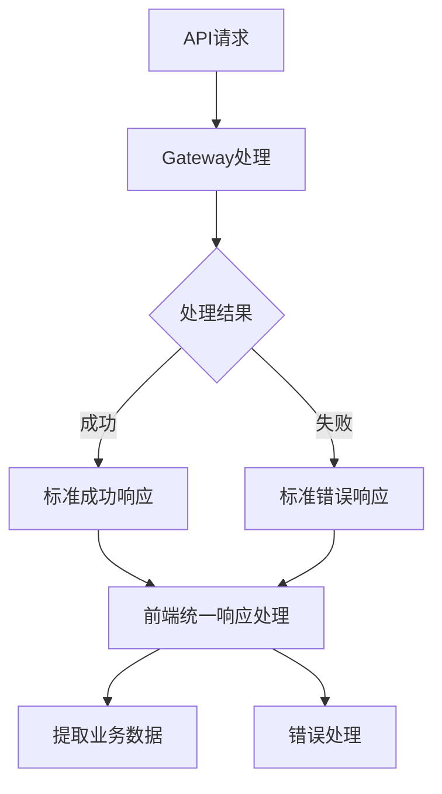
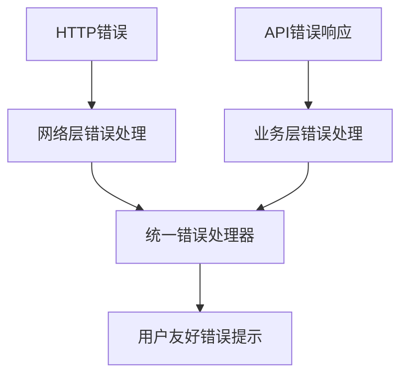
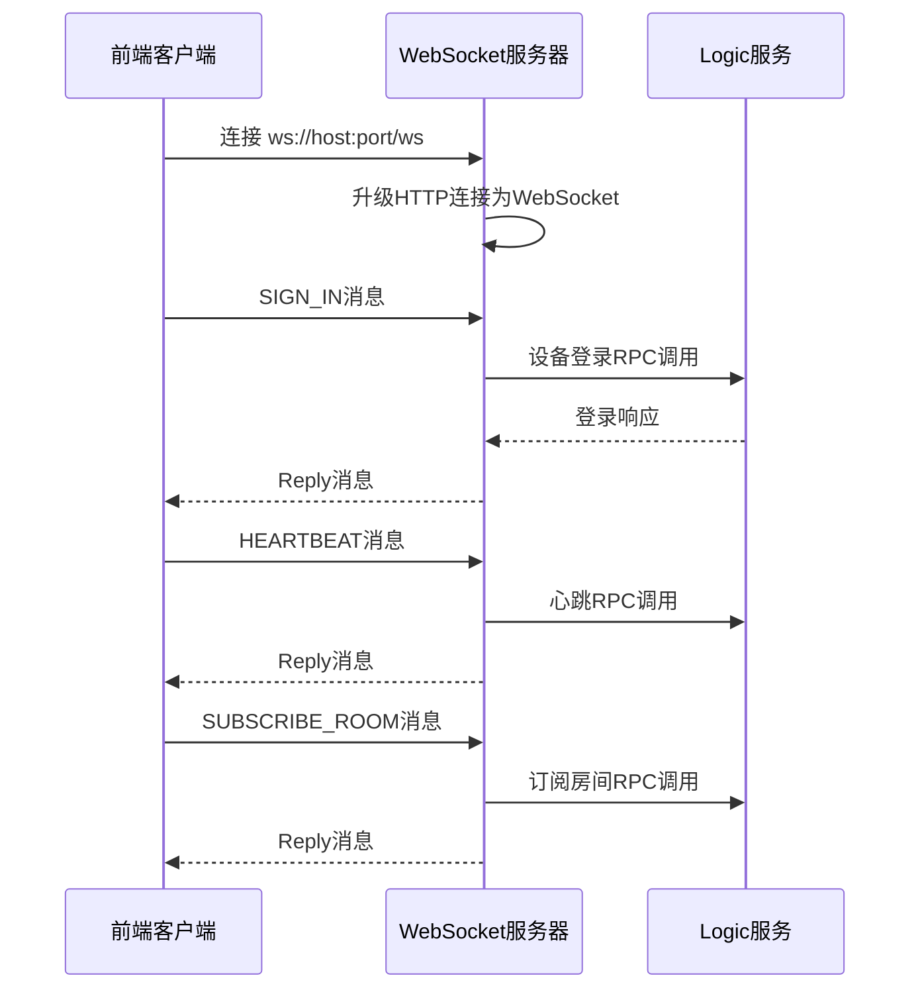

# 前端接口数据对比修复设计

## 1. 概述

通过对比Gateway服务的接口实现和前端React客户端的接口调用，发现前端客户端在API响应数据处理方面存在多个问题。本设计文档详细分析了接口数据不一致的问题，并提供完整的修复方案。

## 2. 问题分析

### 2.1 API响应格式标准化问题

**Gateway统一响应格式**：
```json
{
  "code": 0,
  "message": "success", 
  "data": {...}
}
```

**前端客户端问题**：
- 未按照统一响应格式处理API返回数据
- 直接期望返回业务数据，忽略了包装层
- 缺少错误状态码和错误信息的统一处理

### 2.2 具体接口数据不一致问题

#### 用户登录接口 `/api/user/sign_in`

**Gateway实际返回**：
```json
{
  "code": 0,
  "message": "success",
  "data": {
    "isNew": boolean,
    "userId": number,
    "deviceId": number, 
    "token": string
  }
}
```

**前端期望格式**：
```typescript
// 直接期望LoginResponse格式
interface LoginResponse {
  isNew: boolean;
  userId: number;
  deviceId: number;
  token: string;
}
```

#### 设备注册接口 `/api/device/save`

**Gateway实际返回**：
```json
{
  "code": 0,
  "message": "success", 
  "data": {
    "deviceId": number
  }
}
```

**前端期望格式**：
```typescript
// 直接期望DeviceSaveResponse格式
interface DeviceSaveResponse {
  deviceId: number;
}
```

#### 用户信息接口 `/api/user/profile`

**Gateway实际返回**：
```json
{
  "code": 0,
  "message": "success",
  "data": {
    "userId": number,
    "nickname": string,
    "sex": number,
    "avatarUrl": string,
    "extra": string,
    "createTime": number,
    "updateTime": number
  }
}
```

**前端期望格式**：
```typescript
// 直接期望User对象
interface User {
  userId: number;
  nickname: string;
  sex: number;
  avatarUrl: string;
  extra: string;
  createTime: number; 
  updateTime: number;
}
```

#### 用户搜索接口 `/api/user/search`

**Gateway实际返回**：
```json
{
  "code": 0,
  "message": "success",
  "data": [User, ...]
}
```

**前端期望格式**：
```typescript
// 直接期望User数组
User[]
```

## 3. 修复方案设计

### 3.1 统一响应接口设计



#### 统一响应类型定义

```typescript
interface ApiResponse<T = any> {
  code: number;
  message: string;
  data?: T;
  error?: string;
}
```

### 3.2 前端API客户端重构方案

#### 核心修改点

1. **响应数据解析**：在request方法中统一处理Gateway的标准响应格式
2. **错误处理**：基于code字段判断请求成功与否
3. **类型安全**：确保返回数据类型与业务期望一致

#### request方法重构

```typescript
private async request<T>(
  endpoint: string, 
  options: RequestInit = {}
): Promise<T> {
  // HTTP请求逻辑
  const response = await fetch(url, requestOptions);
  const apiResponse: ApiResponse<T> = await response.json();
  
  // 统一响应处理
  if (apiResponse.code !== 0) {
    throw new ApiError(
      apiResponse.message || 'Request failed',
      response.status,
      apiResponse.code.toString()
    );
  }
  
  return apiResponse.data as T;
}
```

#### 接口方法修复

1. **registerDevice方法**：返回类型调整为`{ deviceId: number }`
2. **signIn方法**：确保返回完整的LoginResponse数据结构
3. **getUser方法**：路径修正为`/api/user/profile`，使用Header传递认证信息
4. **searchUser方法**：处理用户数组数据

### 3.3 认证机制修复

#### 当前问题
- 前端使用URL参数传递userId，但Gateway期望从认证中间件获取
- 认证Header格式和字段名称不统一

#### 修复方案
```typescript
// 认证Header标准化
headers: {
  'Authorization': `Bearer ${token}`,
  'X-User-Id': userId.toString(),
  'X-Device-Id': deviceId.toString()
}
```

### 3.4 错误处理增强

#### 扩展ApiError类

```typescript
export class ApiError extends Error {
  public statusCode?: number;
  public errorCode?: string;
  public details?: any;
  
  constructor(
    message: string,
    statusCode?: number, 
    errorCode?: string,
    details?: any
  ) {
    super(message);
    this.name = 'ApiError';
    this.statusCode = statusCode;
    this.errorCode = errorCode;
    this.details = details;
  }
}
```

#### 分层错误处理



## 4. 实施计划

### 4.1 修复优先级

1. **高优先级**：
   - 修复统一响应格式处理
   - 修复用户登录和设备注册接口
   - 修复认证Header格式

2. **中优先级**：
   - 修复用户信息获取接口
   - 修复用户搜索接口
   - 增强错误处理机制

3. **低优先级**：
   - 优化重试机制
   - 添加请求日志记录

### 4.2 测试策略

#### 单元测试
- API客户端方法测试
- 响应数据解析测试
- 错误处理测试

#### 集成测试
- 与Gateway接口的端到端测试
- 认证流程测试
- 错误场景测试

#### 测试用例设计

```typescript
describe('API Client', () => {
  describe('Response Processing', () => {
    it('should extract data from standard response format');
    it('should handle error responses correctly');
    it('should throw ApiError for non-zero code');
  });
  
  describe('Authentication', () => {
    it('should set correct auth headers');
    it('should handle token refresh');
  });
});
```

## 5. WebSocket协议对接问题分析

### 5.1 Connect服务WebSocket协议

#### 服务端协议实现

**WebSocket服务器端点**：
- 路径：`/ws`
- 消息格式：Protocol Buffers 二进制消息
- 连接类型：`ConnTypeWS = 2`

**消息处理流程**：


#### Protocol Buffers消息结构

**核心消息定义**：
```protobuf
message Message {
  string request_id = 1;     // 请求ID
  Command command = 2;       // 命令类型
  bytes content = 3;         // 消息内容
  uint64 seq = 4;           // 序列号
  int64 created_at = 5;     // 创建时间
  uint64 room_id = 6;       // 房间ID
}

message Reply {
  int32 code = 1;           // 错误码
  string message = 2;       // 错误信息
  bytes data = 3;           // 数据
}
```

**支持的命令类型**：
- `SIGN_IN = 1`：设备登录
- `HEARTBEAT = 2`：心跳保活
- `SUBSCRIBE_ROOM = 3`：订阅房间
- `USER_MESSAGE = 100`：用户消息
- `GROUP_MESSAGE = 101`：群组消息

### 5.2 前端WebSocket实现问题

#### 当前实现状况

**前端协议处理器问题**：
1. **消息编码格式不匹配**：
   - 前端使用自定义二进制编码
   - 服务端期望Protocol Buffers格式

2. **消息结构定义不一致**：
   - 前端`ProtocolMessage`字段命名使用camelCase
   - 服务端protobuf使用snake_case

3. **数据类型不匹配**：
   - 前端使用`number`类型处理64位整数
   - 可能导致精度丢失问题

#### 协议对接修复方案

**1. Protocol Buffers集成**

```typescript
// 安装protobufjs依赖
// npm install protobufjs @types/protobufjs

import { load } from 'protobufjs';

interface ConnectProto {
  Message: any;
  Reply: any;
  SignInRequest: any;
  SubscribeRoomRequest: any;
  Command: any;
}

export class ProtocolHandler {
  private proto: ConnectProto | null = null;
  
  async init(): Promise<void> {
    const root = await load('/proto/connect.proto');
    this.proto = {
      Message: root.lookupType('connect.Message'),
      Reply: root.lookupType('connect.Reply'),
      SignInRequest: root.lookupType('connect.SignInRequest'),
      SubscribeRoomRequest: root.lookupType('connect.SubscribeRoomRequest'),
      Command: root.lookupEnum('connect.Command')
    };
  }
}
```

**2. 消息编解码修复**

```typescript
// 编码登录消息
encodeSignInMessage(userId: number, deviceId: number, token: string): ArrayBuffer {
  if (!this.proto) throw new Error('Protocol not initialized');
  
  // 编码SignInRequest
  const signInRequest = this.proto.SignInRequest.create({
    userId: userId.toString(), // 使用字符串避免精度丢失
    deviceId: deviceId.toString(),
    token
  });
  const signInContent = this.proto.SignInRequest.encode(signInRequest).finish();
  
  // 编码Message
  const message = this.proto.Message.create({
    requestId: this.generateRequestId(),
    command: this.proto.Command.values.SIGN_IN,
    content: signInContent,
    seq: 0,
    createdAt: Date.now(),
    roomId: 0
  });
  
  return this.proto.Message.encode(message).finish();
}

// 解码消息
decodeMessage(buffer: ArrayBuffer): ProtocolMessage {
  if (!this.proto) throw new Error('Protocol not initialized');
  
  const message = this.proto.Message.decode(new Uint8Array(buffer));
  
  return {
    requestId: message.requestId,
    command: message.command,
    content: new Uint8Array(message.content),
    seq: parseInt(message.seq.toString()),
    createdAt: parseInt(message.createdAt.toString()),
    roomId: parseInt(message.roomId.toString())
  };
}
```

**3. WebSocket消息处理修复**

```typescript
private handleMessage(buffer: ArrayBuffer): void {
  try {
    const message = this.protocolHandler.decodeMessage(buffer);
    
    // 处理Reply消息
    if (message.content && message.content.length > 0) {
      const reply = this.protocolHandler.decodeReply(message.content);
      
      if (reply.code !== 0) {
        console.error('服务器返回错误:', reply.code, reply.message);
        this.handleError(new Error(`Server error: ${reply.message}`));
        return;
      }
    }
    
    // 处理不同类型的消息
    switch (message.command) {
      case Command.SIGN_IN:
        this.handleSignInReply(message);
        break;
      case Command.HEARTBEAT:
        this.handleHeartbeatReply(message);
        break;
      case Command.SUBSCRIBE_ROOM:
        this.handleSubscribeRoomReply(message);
        break;
      case Command.USER_MESSAGE:
      case Command.GROUP_MESSAGE:
        this.handleIncomingMessage(message);
        break;
      default:
        console.warn('未知消息类型:', message.command);
    }
    
    // 通知消息处理器
    this.messageHandlers.forEach(handler => {
      try {
        handler(message);
      } catch (error) {
        console.error('消息处理器错误:', error);
      }
    });
  } catch (error) {
    console.error('消息解码失败:', error);
    this.handleError(error instanceof Error ? error : new Error(String(error)));
  }
}
```

### 5.3 消息流程对接修复

#### 登录流程修复

```typescript
// 设备登录流程
async signIn(userId: number, deviceId: number, token: string): Promise<void> {
  // 1. 先调用HTTP API进行设备注册和用户登录
  const loginResponse = await this.apiClient.signIn({
    phoneNumber: '', // 根据实际情况填写
    code: '',
    device: this.createDeviceInfo()
  });
  
  // 2. 使用返回的token和deviceId进行WebSocket登录
  const message = this.protocolHandler.encodeSignInMessage(
    loginResponse.userId,
    loginResponse.deviceId,
    loginResponse.token
  );
  
  await this.sendMessage(message);
  this.isSignedIn = true;
}
```

#### 房间订阅流程修复

```typescript
// 订阅房间消息
subscribeRoom(roomId: number): Promise<void> {
  return new Promise((resolve, reject) => {
    const requestId = this.protocolHandler.generateRequestId();
    
    // 设置响应处理器
    const timeout = setTimeout(() => {
      reject(new Error('Subscribe room timeout'));
    }, 10000);
    
    const handler = (message: ProtocolMessage) => {
      if (message.requestId === requestId && message.command === Command.SUBSCRIBE_ROOM) {
        clearTimeout(timeout);
        const reply = this.protocolHandler.decodeReply(message.content);
        
        if (reply.code === 0) {
          resolve();
        } else {
          reject(new Error(`Subscribe failed: ${reply.message}`));
        }
      }
    };
    
    const unsubscribe = this.onMessage(handler);
    
    // 发送订阅消息
    const message = this.protocolHandler.encodeSubscribeRoomMessage(roomId);
    this.sendMessage(message).catch(reject);
    
    // 清理处理器
    Promise.race([resolve, reject]).finally(() => {
      clearTimeout(timeout);
      unsubscribe();
    });
  });
}
```

### 5.4 类型定义同步修复

#### 更新前端类型定义

```typescript
// 同步protobuf枚举定义
export const Command = {
  UNKNOWN: 0,
  SIGN_IN: 1,
  HEARTBEAT: 2,
  SUBSCRIBE_ROOM: 3,
  USER_MESSAGE: 100,
  GROUP_MESSAGE: 101
} as const;

// 更新消息接口
export interface ProtocolMessage {
  requestId: string;  // request_id
  command: Command;
  content: Uint8Array;
  seq: number;       // uint64 -> number (注意精度)
  createdAt: number; // int64 -> number (注意精度)
  roomId: number;    // uint64 -> number (注意精度)
}

// 更新Reply接口
export interface Reply {
  code: number;      // int32 -> number
  message: string;
  data: Uint8Array;
}

// 更新SignInRequest接口
export interface SignInRequest {
  userId: number;    // uint64 -> number
  deviceId: number;  // uint64 -> number  
  token: string;
}
```

## 6. 架构影响评估

### 6.1 向后兼容性
- HTTP API修复不会破坏现有组件接口
- WebSocket协议修复需要更新消息处理逻辑
- 保持业务逻辑层接口稳定

### 6.2 性能影响
- HTTP响应数据解析增加微小开销
- Protocol Buffers编解码性能优于JSON
- 错误处理逻辑优化减少异常传播

### 6.3 维护性提升
- 统一API响应处理降低维护成本
- Protocol Buffers强类型定义减少运行时错误
- 标准化协议处理提升调试效率
- WebSocket连接状态管理更加可靠